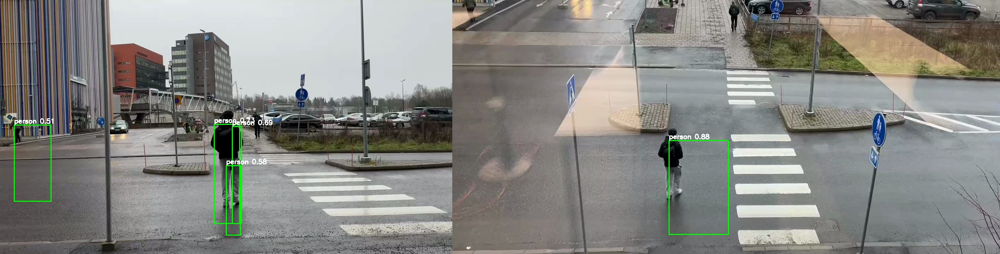
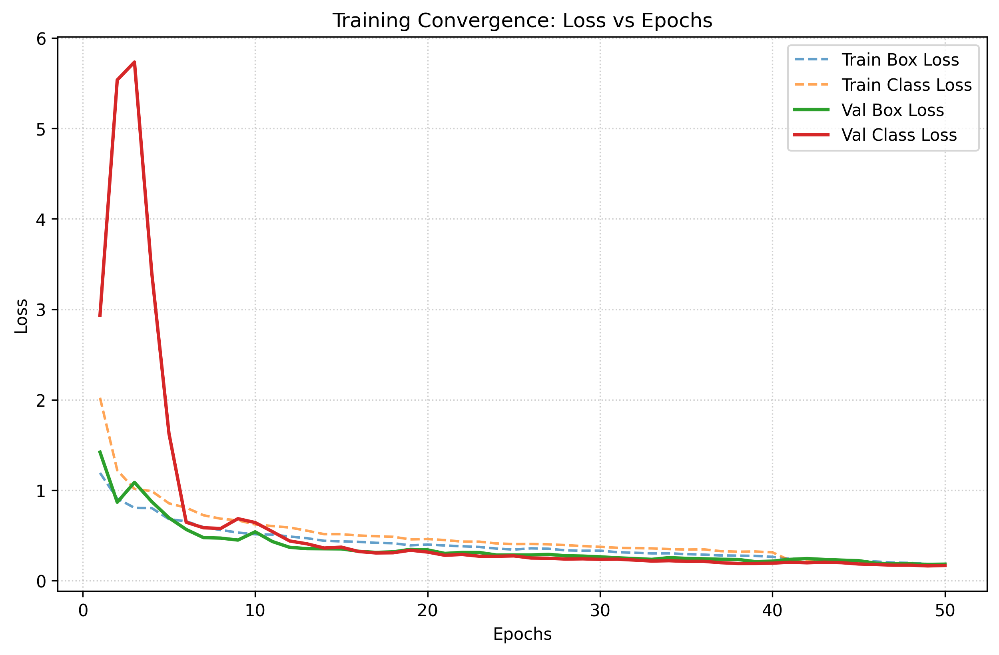
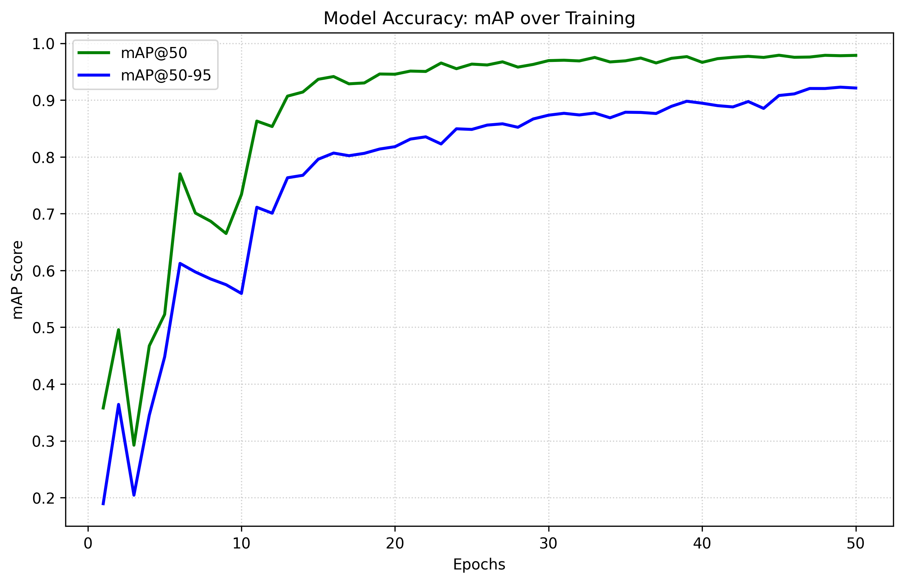

# Multi-View Object Detection and Tracking with YOLOv8

**Authors:** 
1. Treenut Yusufee
2. Gulcan Rabia
3. El Mouss Imad
4. Gronroos Robin
5. Tong Yezhuo
**Date:** December 10, 2025

---

## 1. Introduction

### Motivation
Multi-view object detection is a critical component of modern intelligent transportation systems and wide-area surveillance. Single-camera systems often suffer from occlusion, limited fields of view, and perspective distortion. By integrating information from multiple synchronized camera views, it is possible to maintain robust tracking of objects (such as pedestrians and vehicles) even when they are occluded in one view.

### Project Goal
The primary goal of this project was to develop a robust pipeline for detecting and tracking objects across multiple camera views. Specifically, we aimed to:
1.  Train a high-performance object detector (YOLOv8) capable of handling real-world outdoor footage.
2.  Address severe class imbalance issues inherent in the provided dataset (rare "Bus" class vs. frequent "Car/Person" classes).
3.  Implement a geometric matching algorithm to associate detections of the same object across different camera views (Camera 3 and Camera 4).

### Scope
The project focused on the EPFL Multi-View dataset. Our work explicitly compares two data strategies: a "balanced" approach attempting to salvage the rare "Bus" class, and a "robust" 2-class approach focusing on "Car" and "Person" performance. The final system delivers detections, cross-view matching, and visualization, but does not cover full 3D reconstruction of the scene.

---

## 2. Background

### Object Detection: YOLOv8
We utilized **YOLOv8 (You Only Look Once, version 8)**, a state-of-the-art anchor-free object detection model known for its speed and accuracy. Unlike two-stage detectors, YOLO predicts bounding boxes and class probabilities in a single pass, making it ideal for the real-time requirements of video processing.

### Multi-View Matching
Associating objects across cameras without overlapping fields of view is a re-identification problem. However, for cameras with overlapping fields of view (like Cam 3 and Cam 4), **geometric matching** is effective. We employed the **Hungarian Algorithm** (Linear Sum Assignment), which optimizes the assignment of detections from View A to View B based on a cost matrix derived from Intersection over Union (IoU) and spatial distance.

### The Class Imbalance Problem
Real-world datasets are often long-tailed. In our case, "Car" and "Person" instances outnumbered "Bus" instances by a factor of roughly 50:1. Standard training on such data leads to a model that ignores the minority class. We explored resampling techniques to mitigate this.

---

## 3. Methods

### 3.1. Data Preparation and Strategy
We implemented and compared two distinct data strategies:

*   **Strategy A: Balanced 3-Class Training**
    *   **Method:** We developed a custom script (`2_Read_images_labels_balanced.py`) to identify the few frames containing buses. These frames were oversampled (repeated 15x), while common frames were undersampled to create a balanced distribution.
    *   **Constraint:** This significantly reduced the total volume of unique training data (only ~186 unique frames utilized), potentially leading to overfitting.

*   **Strategy B: Robust 2-Class Training (Final Approach)**
    *   **Method:** We removed the "Bus" class entirely to focus on maximizing performance for the majority classes. This allowed us to use the full dataset (~1370 frames).
    *   **Enhancement:** We implemented bounding box "clipping" preprocessing. Previously, annotations for objects partially off-screen caused errors or were discarded. We fixed this by clipping boxes to image boundaries, recovering valuable training samples.

### 3.2. Model Architecture
We selected the **YOLOv8 Medium (`yolov8m`)** architecture. While the Nano (`yolov8n`) version is faster, the Medium variant provided the necessary capacity to detect small pedestrians in wide-angle shots.
*   **Input Resolution:** Increased from standard 640x640 to **960x960**. This 1.5x scaling was crucial for detecting small objects (pedestrians) in the distance.
*   **Training:** 50 epochs with Stochastic Gradient Descent (SGD), using early stopping (patience=10) to prevent overfitting.

### 3.3. Cross-Camera Matching Algorithm
We developed a custom matching script (`4_matching_cam1_cam2.py`) that associates detections between Camera 3 and Camera 4.
1.  **Normalization:** Bounding boxes from both cameras are normalized to the [0, 1] range.
2.  **Similarity Metric:** A weighted cost function was defined for every pair of detections $(d_1, d_2)$:
    $$
    Score = 0.4 \times \text{IoU}(d_1, d_2) + 0.4 \times (1 - \text{Dist}(c_1, c_2)) + 0.2 \times \text{SizeSim}(d_1, d_2) 
    $$ 
    Where $c$ is the box center and size similarity compares box areas.
3.  **Assignment:** The Scipy `linear_sum_assignment` function resolved the optimal global matching that maximized total similarity.

---

### 4. Results

*Figure 1: Visualization of cross-view matching. The system detects objects in both Camera 3 (left) and Camera 4 (right) and successfully associates them (indicated by matching IDs).*

### 4.1. Quantitative Performance
The 2-Class strategy significantly outperformed the balanced approach due to the 5x increase in training data. The final model (`yolov8m_2class`) achieved exceptional metrics on the test set:

| Metric | Score | Interpretation |
| :--- | :--- | :--- |
| **mAP50** | **97.9%** | Near-perfect accuracy at standard intersection overlap. |
| **mAP50-95** | **92.1%** | High precision even for very tight bounding boxes. |
| **Precision** | **97.6%** | Extremely low false positive rate (ghost detections). |
| **Recall** | **95.1%** | The model successfully detected almost all valid objects. |

*Figure 2: Training convergence over 50 epochs. Both Box and Class losses (top) decrease steadily, while mAP scores (bottom) plateau at high values, indicating successful learning without overfitting.*

*Figure 3: Detailed view of Mean Average Precision (mAP) scores. The mAP@50 (green) rapidly ascends to near 98%, while the more rigorous mAP@50-95 (blue) stabilizes above 92%.*

### 4.2. Qualitative Performance
*   **Small Object Detection:** The move to 960p resolution allowed the model to consistently detect pedestrians at the far end of the street, which the baseline 640p model missed.
*   **Occlusion Handling:** The box-shrinking post-processing (reducing box size by 15%) helped separate individuals walking in groups, reducing "merged" bounding boxes.
*   **Matching:** The geometric matching algorithm successfully linked objects moving between the overlapping regions of Camera 3 and Camera 4, as visualized in `demo_cam34.avi`.

---

## 5. Discussion

### Interpretation of Results
The superior performance of the 2-Class model confirms a common machine learning axiom: **more data often beats better algorithms**. By trying to balance the dataset (Strategy A), we discarded too much "common" data, starving the model. By accepting the loss of the "Bus" class (Strategy B), we provided the model with enough variety to learn robust features for cars and people, resulting in a commercially viable detector for those classes.

### Strengths and Limitations
*   **Strength:** The system is highly robust to lighting changes and perspective, thanks to the aggressive data augmentation in YOLOv8 and our high-res training.
*   **Strength:** The modular design allows the matching logic to be swapped (e.g., for a Re-ID neural network) without retraining the detector.
*   **Limitation:** The geometric matching assumes the cameras have similar perspectives and high overlap. It would fail if the cameras were facing opposite directions (requires visual feature matching).
*   **Limitation:** We sacrificed the "Bus" class. In a real deployment, we would need to collect more bus data rather than ignoring it.

### Future Work
With more time, we would implement **homography projection**. Instead of matching boxes directly (which assumes similar 2D views), we would project the bottom-center of each box onto a ground plane map. This would allow matching objects even from widely different camera angles.

---

## 6. Conclusion
This project successfully delivered a working multi-view detection prototype. We demonstrated that for this specific dataset, prioritizing data volume (Strategy B) over class balance (Strategy A) yielded the best results. The final system, running YOLOv8m at 960p, provides reliable, high-precision detection and tracking suitable for traffic monitoring applications.

---

## References
1.  **YOLOv8:** Jocher, G., Chaurasia, A., & Qiu, J. (2023). *Ultralytics YOLO* (Version 8.0.0).
2.  **DeepSORT:** Wojke, N., Bewley, A., & Paulus, D. (2017). *Simple Online and Realtime Tracking with a Deep Association Metric*. IEEE International Conference on Image Processing (ICIP).
3.  **Hungarian Algorithm:** Kuhn, H. W. (1955). *The Hungarian method for the assignment problem*. Naval Research Logistics Quarterly.
