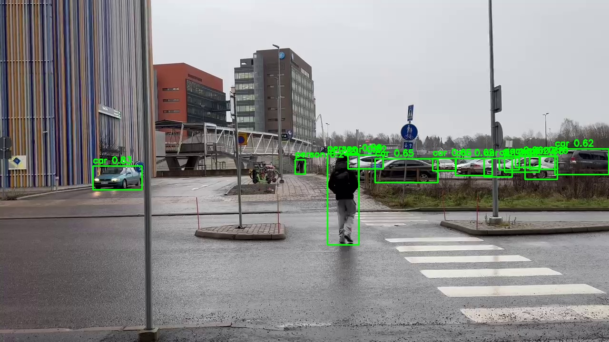
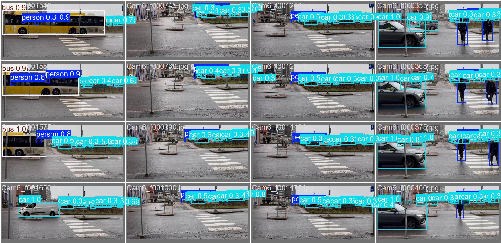

# Multi-View Object Detection & Tracking (SAM3 → YOLO → Multi-Camera)

This repo implements an end-to-end pipeline for multi-view detection and tracking across synchronized cameras:

1) Label videos with YOLO proposals + SAM3 mask refinement.
2) Train a YOLO detector.
3) Run multi-view detection + tracking with camera groups.

## Visual showcase

<p align="center">
  
  
</p>

<p align="center">
  <em>Left: SAM3 auto-labeling overlay. Right: YOLO validation predictions.</em>
</p>

## Demo (no training required)

Use the tracked artifacts for a quick walkthrough:

- Labeling samples: `data/processed/showcase/sam3_autolabel_v2/viz/val/`
- Training metrics: `results/showcase/training/sam3_autolabel_v2/results.png`
- Tracking output: `results/showcase/system/sam3_autolabel_v2/g34_demo.mp4`

## Showcase artifacts (tracked)

- Labeling samples: `data/processed/showcase/sam3_autolabel_v2/` (viz + metadata)
- Training metrics: `results/showcase/training/sam3_autolabel_v2/`
- Evaluation demo: `results/showcase/system/sam3_autolabel_v2/` (`g34_demo.mp4`, `g34.json`)

## Local assets (offline-ready)

This workspace contains the full assets needed to work offline:

- Raw videos: `data/raw/testing_videos/*.mp4` (and `latest_video.MOV`)
- Ground truth: `data/raw/multiclass_ground_truth/`, `data/raw/multiclass_ground_truth_images/`
- Processed datasets: `data/processed/sam3_autolabel_v2/` (plus `_debug_cam1`, `_demo_viz_v1`, `_smoke_sam3`)
- YOLO base weights: `checkpoints/yolo/*.pt`
- SAM3 checkpoint: `checkpoints/sam3/sam3.pt`
- Training outputs: `results/training/sam3_autolabel_v2/` (includes `weights/best.pt`)
- MLflow runs: `runs/`

## Install

```bash
pip install -r requirements.txt
pip install -e .
```

Optional:
- `pip install -e ".[tracking]"` to enable the `torch_resnet18` embedder.

## SAM3

SAM3 source is included locally under `sam3/` for offline use. Install it with:

```bash
pip install -e sam3
```

If you prefer a separate clone, follow https://github.com/facebookresearch/sam3 and ensure `sam3` is importable.

## 1) Label videos (SAM3 → YOLO)

Edit `config/labeling.yaml`, then run:

```bash
multiview label --config config/labeling.yaml
```

To override the SAM3 checkpoint, pass `--sam3-checkpoint /path/to/sam3.pt`.

Dataset layout:

```text
data/processed/<dataset_name>/
  dataset.yaml
  train/images/*.jpg
  train/labels/*.txt
  val/...
  test/...
  meta.json
  stats.json
```

Verify:

```bash
multiview verify --dataset data/processed/<dataset_name>/dataset.yaml
```

## 2) Train YOLO

Edit `config/train.yaml`, then:

```bash
multiview train --config config/train.yaml
```

## 3) Run multi-view detection + tracking

Edit `config/system.yaml`, then:

```bash
multiview run --config config/system.yaml
```

Outputs per-group JSON and optional videos.

## Data and outputs

- `data/raw/` and most of `data/processed/` are ignored by git.
- Track curated samples in `data/processed/showcase/`.
- Most of `results/` is ignored; track demos and proof artifacts in `results/showcase/`.
- Large local assets also live in `checkpoints/`, `sam3/`, and `runs/` (kept out of git).

Showcase paths:
- Labeling: set `out: data/processed/showcase/<dataset_name>` in `config/labeling.yaml`.
- Training: set `project: results/showcase/training` in `config/train.yaml`.
- Evaluation: set `output.dir: results/showcase/system/<run_name>` in `config/system.yaml`.

## SLURM

See `slurm/label.sbatch`, `slurm/train.sbatch`, and `slurm/run.sbatch`.
Submit the full pipeline with:

```bash
bash slurm/submit_pipeline.sh
```
